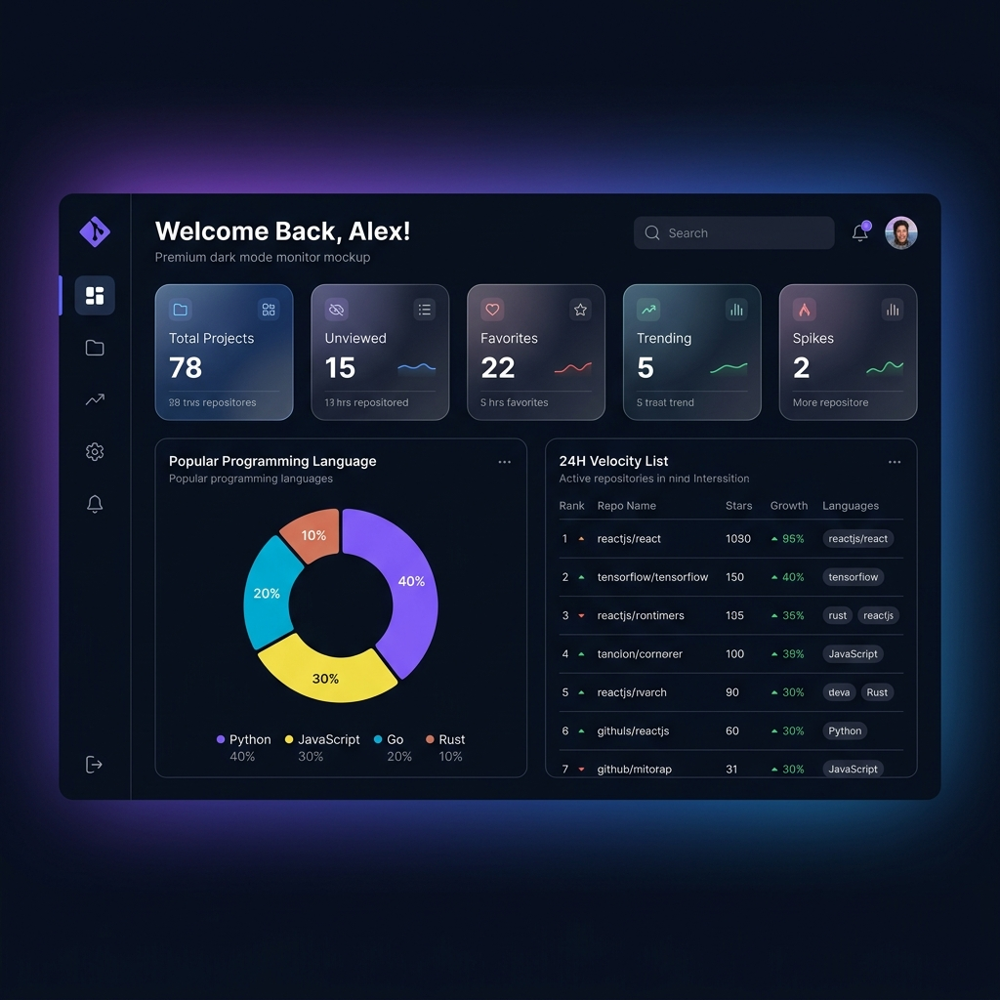
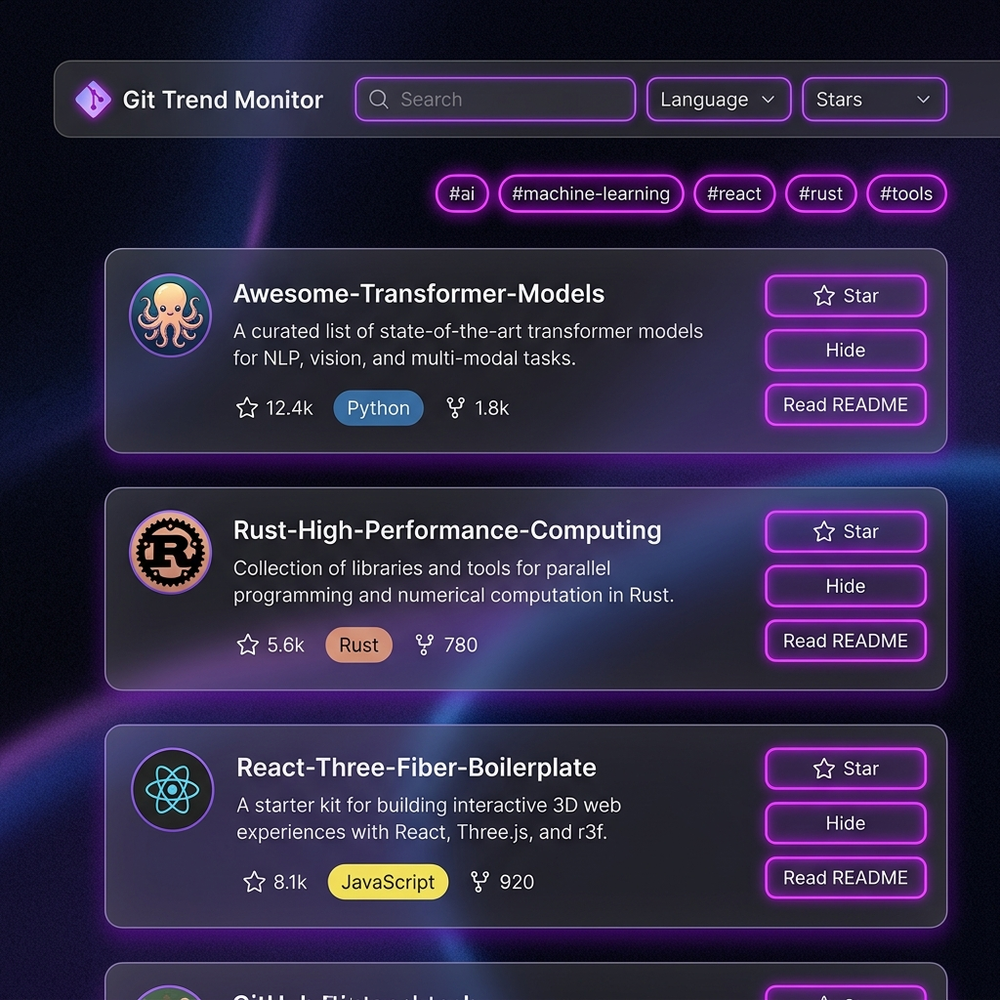
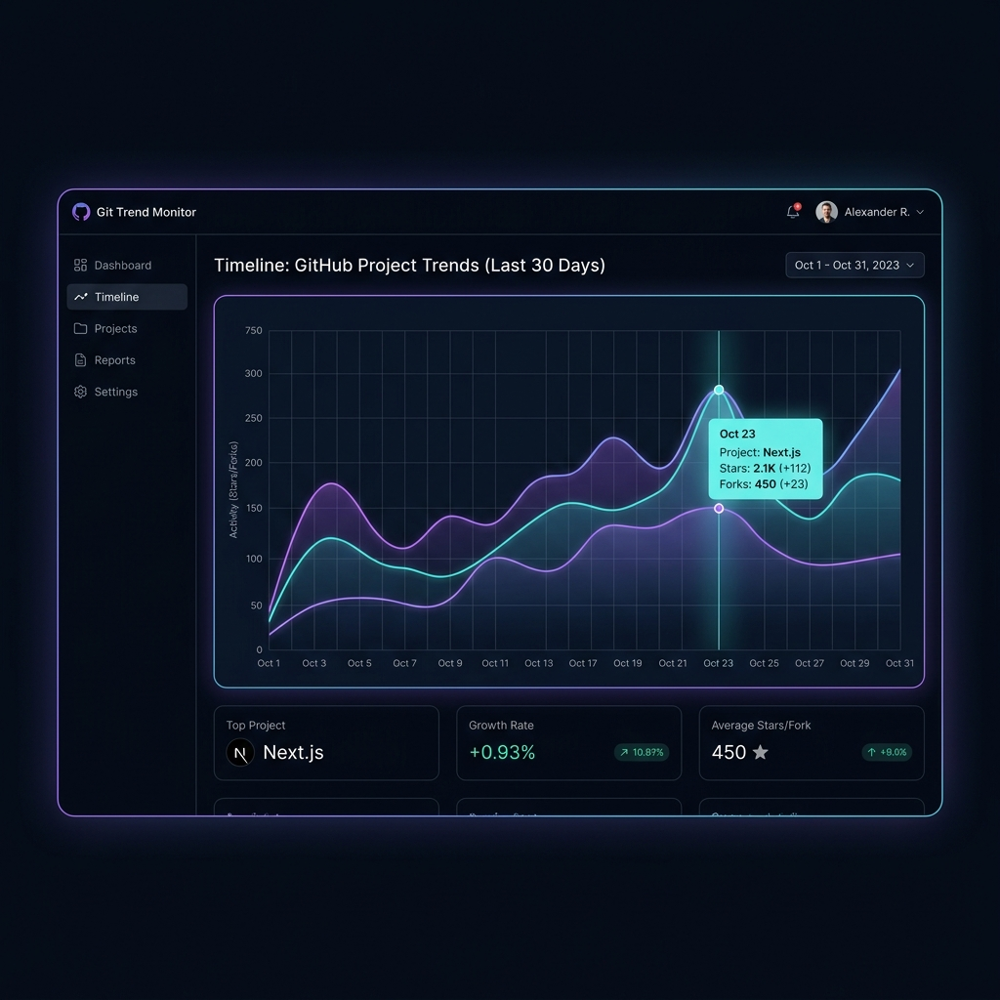

# 🎬 Git Trend Monitor

> **Git Trend Monitor** 是一款面向开发者与技术趋势研究者的 GitHub 热门项目全景仪表盘。它能够自动追踪、智能预警和多维管理 GitHub 上的趋势项目，帮助您在繁杂的信息流中秒级定位高价值的开源项目。

---

## 📸 界面预览

为提供极致的视觉体验，系统前端采用了基于 **毛玻璃（Glassmorphism）效果** 的现代化暗色主题 UI。以下为系统核心功能模块的真实展示：

### 1. 核心仪表盘 (Dashboard)

展示今日抓取统计、热门语言分布图表（基于 Chart.js 动态绘制饼图）以及 Star 24H 飙升榜。


---

### 2. 多维项目检索与主题云 (All Projects)

提供语言、Star 阈值等多重高级筛选，更有按 GitHub Topic 聚合的主题标签云，支持收藏、隐藏和批量已看。


---

### 3. 时间线趋势分析 (Timeline)

直观呈现每日项目抓取数量及长期趋势，辅助分析 GitHub 社区热点技术走势。


---

## ✨ 核心功能

- 📈 **仪表盘总览**：一屏掌握今日新增、未查看、收藏、趋势以及 Star 异常飙升项目。
- 🚨 **趋势与飙升预警**：根据 Star 增速（24H/7D 增长率）自动识别异常暴涨的潜力股项目，予以视觉高亮。
- 🔍 **多维度智能筛选**：支持按语言类型、Star 区间、创建时间、最近更新时间等交叉组合筛选。
- 🏷️ **标签云热词分析**：自动提取抓取项目中的 Top Topics，并在前端形成可交互的标签云，方便一键下钻。
- ⌨️ **极客快捷键支持**：专为键盘流用户设计，通过简单的按键即可实现项目切换、收藏、归档以及查看 README 抽屉。
- ⏱️ **自动抓取机制**：后台集成定时任务，周期性拉取 GitHub Search API 并进行增量数据更新。

---

## 🛠 技术栈

### 后端服务

- **核心框架**：[FastAPI](https://fastapi.tiangolo.com/) (高性能、异步 Python Web 框架)
- **数据库 ORM**：[SQLAlchemy 2.0](https://www.sqlalchemy.org/) + [aiosqlite](https://github.com/nbraha/aiosqlite) (异步操作 SQLite)
- **定时调度**：[APScheduler](https://apscheduler.readthedocs.io/) (后台异步抓取任务)
- **数据源**：GitHub Search API v3

### 前端界面

- **核心技术**：原生 HTML5 + 现代化 CSS3（自定义 CSS 变量 + 毛玻璃特效 + 响应式布局） + 原生 JavaScript
- **图表库**：[Chart.js](https://www.chartjs.org/) (用于饼图与折线图的异步渲染)
- **渲染工具**：[marked.js](https://marked.js.org/) (用于在抽屉中将项目 README 渲染为 Markdown 页面) + DOMPurify (防范 XSS 攻击)
- **图标库**：Font Awesome 6.5.1

---

## 🗄 数据库结构

系统采用 SQLite 作为数据存储，包含三个核心表模型。其设计结构如下：

### 1. `projects` (项目详情表)

保存 GitHub 仓库的元数据和用户交互状态：

| 字段名                | 类型           | 说明                |
|:------------------ |:------------ |:----------------- |
| `id`               | Integer (PK) | 自增主键              |
| `github_id`        | Integer      | GitHub 唯一标识（唯一索引） |
| `name`             | String(500)  | 项目名称              |
| `full_name`        | String(500)  | 完整拥有者/项目名（唯一索引）   |
| `description`      | Text         | 仓库描述              |
| `url`              | String(1000) | GitHub 仓库链接       |
| `homepage`         | String(1000) | 项目官方主页            |
| `owner_avatar_url` | String(1000) | 项目所有者头像           |
| `language`         | String(100)  | 主要开发语言（索引）        |
| `stars`            | Integer      | 当前 Star 数量（索引）    |
| `forks`            | Integer      | Fork 数量           |
| `star_growth_24h`  | Float        | 24小时内 Star 增长率    |
| `is_viewed`        | Boolean      | 用户是否已查看（索引）       |
| `is_favorite`      | Boolean      | 用户是否已收藏（索引）       |
| `is_hidden`        | Boolean      | 用户是否隐藏（索引）        |
| `is_trending`      | Boolean      | 是否标记为趋势项目         |
| `spike_detected`   | Boolean      | 是否检测到 Star 飙升     |

### 2. `daily_snapshots` (每日快照表)

用于追踪历史走势，支撑时间线图表渲染：

| 字段名             | 类型           | 说明                     |
|:--------------- |:------------ |:---------------------- |
| `id`            | Integer (PK) | 自增主键                   |
| `project_id`    | Integer      | 外键指向 `projects.id`（索引） |
| `stars`         | Integer      | 快照时 Star 数量            |
| `forks`         | Integer      | 快照时 Fork 数量            |
| `snapshot_date` | DateTime     | 记录时间（索引）               |

### 3. `fetch_logs` (抓取日志表)

监控后台抓取任务健康状态：

| 字段名               | 类型           | 说明                   |
|:----------------- |:------------ |:-------------------- |
| `id`              | Integer (PK) | 自增主键                 |
| `fetched_at`      | DateTime     | 执行时间                 |
| `projects_count`  | Integer      | 本次抓取的项目数             |
| `new_projects`    | Integer      | 增量新发现的项目数            |
| `spikes_detected` | Integer      | 本次检测到的飙升项目数          |
| `status`          | String(50)   | `success` / `failed` |
| `error_message`   | Text         | 错误详情                 |

---

## 🚀 快速开始

### 方式一：Windows 一键启动（推荐）

双击根目录下的 `启动.bat`，脚本将自动完成以下操作：

1. 检测并验证系统中的 Python 3.8+ 环境。
2. 自动安装 `requirements.txt` 中所需的所有依赖。
3. 异步启动 FastAPI 挂载的 Uvicorn 服务。
4. 自动唤起默认浏览器并打开系统界面：`http://localhost:8000`。

### 方式二：手动命令行启动

1. **安装项目依赖**
   
   ```bash
   pip install -r requirements.txt
   ```

2. **配置环境变量**
   复制 `.env.example` 并重命名为 `.env`，填入您的 GitHub Token：
   
   ```ini
   GITHUB_TOKEN=your_github_personal_access_token
   DATABASE_URL=sqlite+aiosqlite:///./git_trend.db
   FETCH_INTERVAL_MINUTES=60
   PORT=8000
   ```
   
   > ⚠️ **提示**：配置 `GITHUB_TOKEN` 可将 API 请求速率从 60次/小时 提升至 5000次/小时，防止拉取频繁导致被 GitHub 限流。

3. **启动 Web 服务器**
   
   ```bash
   python -m uvicorn app.main:app --host 0.0.0.0 --port 8000 --reload
   ```

---

## ⌨️ 快捷键系统

在“全部项目”和“收藏夹”视图中，您可以直接使用键盘完成高效浏览：

| 按键                          | 功能说明                                 |
|:---------------------------:|:------------------------------------ |
| <kbd>↑</kbd> / <kbd>↓</kbd> | 切换上下聚焦的 GitHub 项目卡片                  |
| <kbd>Enter</kbd>            | 在新标签页中打开当前选中项目的 GitHub 仓库            |
| <kbd>V</kbd>                | 将当前聚焦项目标记为“已查看”（自动从当前列表中归档/移除）       |
| <kbd>F</kbd>                | 将当前聚焦项目加入“收藏夹” / 从“收藏夹”中移除           |
| <kbd>R</kbd>                | 快捷展开当前项目的 **README 内容抽屉**（直接在右侧无缝预览） |
| <kbd>Esc</kbd>              | 关闭当前弹出的 README 内容抽屉                  |

---

## 🔌 开放 API 接口说明

系统内置了标准 RESTful API，方便与其他系统或看板无缝集成：

| 请求方式     | API 路由                        | 描述说明                                                      |
|:--------:|:----------------------------- |:--------------------------------------------------------- |
| **GET**  | `/api/projects`               | 分页获取项目列表（支持 `search`, `language`, `min_stars`, `sort` 筛选） |
| **GET**  | `/api/stats`                  | 获取全局统计数据（总数、未读数、收藏数、飙升数）                                  |
| **GET**  | `/api/languages`              | 获取当前已抓取项目包含的语言列表                                          |
| **GET**  | `/api/timeline`               | 获取时间线图表数据（每日快照趋势）                                         |
| **PUT**  | `/api/projects/{id}/viewed`   | 标记单条项目为已查看                                                |
| **PUT**  | `/api/projects/{id}/favorite` | 切换单条项目的收藏状态                                               |
| **PUT**  | `/api/projects/{id}/hide`     | 隐藏或还原单条项目                                                 |
| **PUT**  | `/api/projects/batch-viewed`  | 批量标记传入的多个 ID 项目为已查看                                       |
| **POST** | `/api/fetch`                  | 手动触发后台 GitHub 爬虫抓取逻辑                                      |
